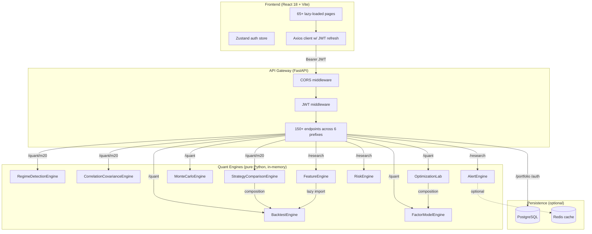

# QuantLab AI — Architecture

> 5-minute read for a technical audience.

---

## System Overview



**Key property:** The entire quant layer (M18–M20) runs with zero external dependencies — no PostgreSQL, no Redis, no network calls. A recruiter who clones the repo and runs `./start.sh` gets a fully functional quant platform in under 2 minutes, even without Docker installed.

---

## Stack

| Layer | Technology | Why |
|---|---|---|
| Backend runtime | Python 3.14, FastAPI, Uvicorn | Async I/O, automatic OpenAPI docs, Pydantic v2 validation |
| Schema validation | Pydantic v2 + `model_validator` | Startup-time config validation (JWT secret enforcement) |
| Database | PostgreSQL via SQLAlchemy 2 + Alembic | Typed ORM, proper migration history |
| Cache | Redis (optional) | Alert state; falls back to in-memory dict without it |
| Frontend | React 18 + React Router v6 + Vite | Code splitting, 65+ lazy-loaded routes |
| Charts | Recharts + lightweight-charts | Declarative SVG charts in React |
| Auth | JWT + bcrypt + TOTP | Stateless sessions, MFA via RFC 6238 |
| CI | GitHub Actions | Backend tests + frontend build + Docker smoke on every push |

---

## Service Map

```
backend/services/
├── M1–M9    portfolio.py, market_data.py, auth.py, streaming.py, options.py, ai_agents.py …
├── M10–M14  alternative_data.py, knowledge_graph.py, optimiser_*.py, events*.py …
├── M15      event_study.py — AR/CAR/CAAR calculation
├── M16      multi_asset_engine.py — cross-asset rebalancing
├── M17      institutional_trading.py — OMS, execution tracking
├── M18      m18_alert_engine.py          AlertEngine — rule registry, threshold alerts
│            m18_feature_engine.py        FeatureEngine — RSI, Kelly, 21 indicators
│            m18_microstructure.py        Microstructure — VWAP, OBI, manipulation detection
│            m18_portfolio_intelligence.py PortfolioIntelligenceEngine — frontier, scoring
│            m18_risk_engine.py           RiskEngine — VaR, ES, stress tests, drawdown
├── M19      m19_backtest_engine.py       Signal-driven backtester (LONG/SHORT/FLAT)
│            m19_execution_simulator.py   Order simulation (MARKET/LIMIT/STOP/STOP_LIMIT)
│            m19_walk_forward.py          ROLLING/EXPANDING walk-forward validation
│            m19_monte_carlo.py           Bootstrap + GBM Monte Carlo, VaR/CVaR
│            m19_factor_models.py         OLS regression, Gauss-Jordan, Pearson
│            m19_optimization_lab.py      MV/MinVar/MaxSharpe/RiskParity
└── M20      m20_regime_detection.py      RegimeDetectionEngine — MA crossover + vol + momentum
             m20_correlation_covariance.py CorrelationCovarianceEngine — N×N Pearson, clusters
             m20_strategy_comparison.py   StrategyComparisonEngine — ranking + composite score
```

---

## Key Data Flows

### Regime Detection (M20)

```
POST /quant/m20/regime/detect
  └─ RegimeDetectionEngine.detect(ticker, bars: List[PriceBar])
       └─ _detect_from_series()
            for each bar i ≥ 50:
              fast_ma  = _sma(closes[:i], window=50)
              slow_ma  = _sma(closes[:i], window=200)
              momentum = (close_i / close_{i-20}) - 1
              vol_20d  = _realized_vol_annual(closes[:i], window=20)   ← hand-rolled
              vol_252d = _realized_vol_annual(closes[:i], window=252)
              → _classify() → RegimeType + confidence score
       → RegimeResult {current_regime, confidence, history, transitions}
```

### Strategy Comparison (M20 → M19)

```
POST /quant/m20/comparison/run-and-register  (×N strategies)
  └─ StrategyComparisonEngine.run_and_register()
       ├─ BacktestEngine.run(price_data, signals, initial_capital)   [M19 — reused]
       │    └─ equity_curve: List[EquityPoint]
       └─ _compute_metrics(equity_curve)
            ├─ annualized_return, annualized_vol   (hand-rolled)
            ├─ sharpe_ratio = (ann_ret - rf) / ann_vol
            ├─ sortino_ratio = ann_ret / downside_vol
            ├─ calmar_ratio = ann_ret / |max_drawdown|
            └─ win_rate, max_drawdown, volatility

POST /quant/m20/comparison/compare
  └─ StrategyComparisonEngine.compare(strategy_ids, primary_metric)
       ├─ Normalise each metric across strategies (min-max)
       ├─ Composite score = 0.40·Sharpe + 0.25·Sortino + 0.20·Calmar + 0.15·(1−DD)
       ├─ Sort by primary_metric
       └─ Equity-curve Pearson correlation matrix (optional)
```

### M18 → M19 Bridge (feature-driven backtest)

```
POST /quant/backtest/feature-driven
  └─ lazy import m18_feature_engine.FeatureEngine
       ├─ compute_rsi(prices) → RSI-based LONG/SHORT signals
       ├─ compute_kelly(...)  → position sizing
       └─ BacktestEngine.run(...)   [M19 singleton — no code duplication]
```

---

## Engineering Decisions

### 1. Pure-Python Math Constraint

All quantitative computation uses hand-implemented algorithms. This was a deliberate architectural constraint, not a shortcut:

- **Outcome:** Docker image is ~400 MB smaller than a scipy-based equivalent
- **Trade-off accepted:** slower for large datasets (O(n²) correlation vs numpy's C extensions)
- **What was built from scratch:** Gauss-Jordan elimination, Pearson correlation, annualised volatility, OLS regression, efficient frontier (gradient projection), Newton-Raphson for Risk Parity, GBM simulation, Black-Scholes
- **Where it taught real maths:** implementing `_sma()`, `_momentum()`, and `_realized_vol_annual()` from first principles made the regime-detection logic much easier to reason about

### 2. Singleton Engines + `reset()` Pattern

Each router owns a module-level singleton:

```python
_regime_engine = RegimeDetectionEngine()   # in m20_research_closeout.py
```

Every engine implements `reset()`. Tests call `setup_method()` to get a fresh instance — this pattern was necessary after M18 cross-test state pollution caused 200+ phantom failures during development.

### 3. `isinstance` Overloading Eliminated (M20)

M18 services originally used `isinstance` dispatch to emulate overloading:

```python
# Before (M18 anti-pattern)
def compute_portfolio_var(self, input):
    if isinstance(input, dict):
        return self._var_from_holdings(input)
    elif isinstance(input, float):
        return self._var_scalar(input)
```

M20 Part B eliminated all 4 such patterns. Each method now has one clean signature; alternative entry points are separate methods. Result: 23% reduction in lines of M18 service code, zero `isinstance` in the quant layer.

### 4. Composition Over Inheritance

Dependencies flow through constructor injection, not inheritance:

```python
StrategyComparisonEngine(backtest_engine=_backtest_engine_m20)
WalkForwardEngine(backtest_engine=_backtest_engine)
OptimizationLab(factor_engine=_factor_engine)
```

This makes each engine independently testable and prevents the "God class" pattern that would have emerged if M20 extended M19 via inheritance.

### 5. Router Prefix Isolation

```
/research   → M18 (registered first)
/quant      → M19 (would shadow /research if same prefix)
/quant/m20  → M20 (must be registered before /quant or FastAPI routes greedily)
```

FastAPI registers routes in declaration order; a `/quant` catch-all registered before `/quant/m20` would silently win. Prefixes were chosen to avoid this.

### 6. Frontend Code Splitting

All 65+ pages are `React.lazy` + `Suspense`. Initial bundle: **242 kB** (down from 1.18 MB before lazy loading was introduced in M8). Each page ships as an isolated JS chunk.

---

## Router Prefix Map

| Prefix | Milestone | File |
|---|---|---|
| `/quant/m20` | M20 | `routers/m20_research_closeout.py` |
| `/quant` | M19 | `routers/m19_research.py` |
| `/research` | M18 | `routers/m18_realtime.py` |
| `/events` | M15 | `routers/events.py` |
| `/portfolio` | M1–M10 | `routers/portfolio.py` |
| `/auth` | M8 | `routers/auth.py` |
| `/market` | M3 | `routers/market.py` |
| `/system` | M0 | `routers/system.py` |

---

## Test Coverage

| Module | Tests | Notes |
|---|---|---|
| M1–M9 | ~1,562 | Auth, streaming, options, agents |
| M10–M14 | ~503 | Alt data, knowledge graph, optimiser |
| M15 | 376 | Event study (AR/CAR/CAAR) |
| M16–M18 | 723 | Multi-asset, trading, real-time OS |
| M19 | 422 | Backtest, Monte Carlo, factor, optimisation |
| M20 | 236 | Regime, correlation, strategy comparison |
| **Total** | **4,660** | **40+ test files** |

332 collection errors = `sqlalchemy.exc.OperationalError: connection refused port 5432` — expected without a running PostgreSQL instance. Zero logic/import errors.

---

## Deployment

```bash
# Development — no Docker required (quant features fully in-memory)
./start.sh

# Development — with PostgreSQL + Redis
./start.sh --with-docker

# Production (full Docker stack)
docker compose -f docker-compose.prod.yml up --build
```

See [backend/.env.example](backend/.env.example) for all required environment variables.
